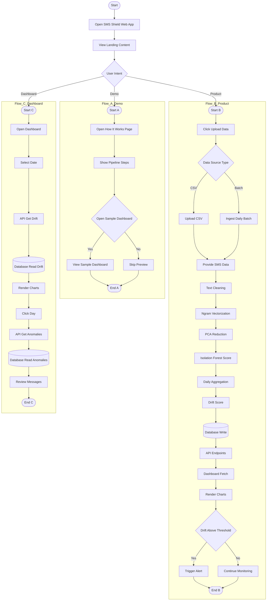

# SMS Shield User Flow

```mermaid
flowchart TD

A([Start])
A --> B[Open SMS Shield Web App]
B --> C[View Landing Content]
C --> D{User Intent}

D -->|Demo| FA1
D -->|Product| FB1
D -->|Dashboard| FC1


subgraph Flow_A_Demo
FA1([Start A])
FA1 --> FA2[Open How It Works Page]
FA2 --> FA3[Show Pipeline Steps]
FA3 --> FA4{Open Sample Dashboard}
FA4 -->|Yes| FA5[View Sample Dashboard]
FA4 -->|No| FA6[Skip Preview]
FA5 --> FA7([End A])
FA6 --> FA7
end


subgraph Flow_B_Product
FB1([Start B])
FB1 --> FB2[Click Upload Data]
FB2 --> FB3{Data Source Type}

FB3 -->|CSV| FB4A[Upload CSV]
FB3 -->|Batch| FB4B[Ingest Daily Batch]

FB4A --> FB5[Provide SMS Data]
FB4B --> FB5

FB5 --> FB6[Text Cleaning]
FB6 --> FB7[Ngram Vectorization]
FB7 --> FB8[PCA Reduction]
FB8 --> FB9[Isolation Forest Score]
FB9 --> FB10[Daily Aggregation]
FB10 --> FB11[Drift Score]

FB11 --> FB12[(Database Write)]
FB12 --> FB13[API Endpoints]
FB13 --> FB14[Dashboard Fetch]
FB14 --> FB15[Render Charts]

FB15 --> FB16{Drift Above Threshold}
FB16 -->|Yes| FB17[Trigger Alert]
FB16 -->|No| FB18[Continue Monitoring]

FB17 --> FB19([End B])
FB18 --> FB19
end


subgraph Flow_C_Dashboard
FC1([Start C])
FC1 --> FC2[Open Dashboard]
FC2 --> FC3[Select Date]
FC3 --> FC4[API Get Drift]
FC4 --> FC5[(Database Read Drift)]
FC5 --> FC6[Render Charts]
FC6 --> FC7[Click Day]
FC7 --> FC8[API Get Anomalies]
FC8 --> FC9[(Database Read Anomalies)]
FC9 --> FC10[Review Messages]
FC10 --> FC11([End C])
end
```
